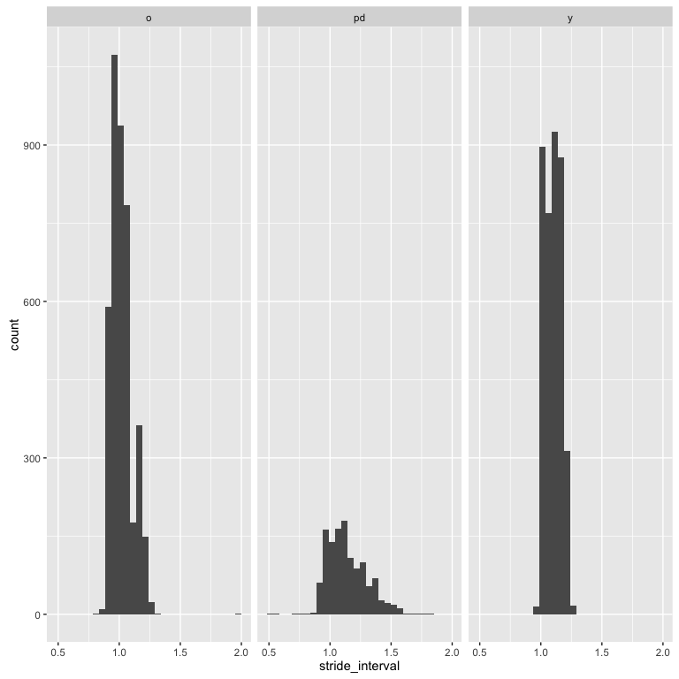
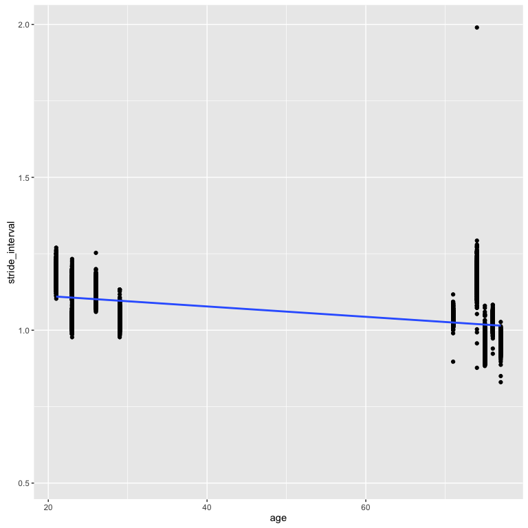

Exploratory Data Analysis
=========================

Visualization
-------------

    #> Source: local data frame [3 x 3]
    #> 
    #>   trial mean(stride_interval) sd(stride_interval)
    #>   (chr)                 (dbl)               (dbl)
    #> 1     o              1.021679          0.08354188
    #> 2    pd              1.138236          0.16253270
    #> 3     y              1.101055          0.06437903

Modeling
--------

    #> 
    #> Call:
    #> glm(formula = parkinsons ~ stride_interval, family = binomial(link = "logit"), 
    #>     data = intervals)
    #> 
    #> Deviance Residuals: 
    #>     Min       1Q   Median       3Q      Max  
    #> -2.8998  -0.5799  -0.4457  -0.3435   3.3945  
    #> 
    #> Coefficients:
    #>                 Estimate Std. Error z value            Pr(>|z|)    
    #> (Intercept)      -9.2769     0.3371  -27.52 <0.0000000000000002 ***
    #> stride_interval   6.7671     0.3012   22.47 <0.0000000000000002 ***
    #> ---
    #> Signif. codes:  0 '***' 0.001 '**' 0.01 '*' 0.05 '.' 0.1 ' ' 1
    #> 
    #> (Dispersion parameter for binomial family taken to be 1)
    #> 
    #>     Null deviance: 7188.0  on 9143  degrees of freedom
    #> Residual deviance: 6628.1  on 9142  degrees of freedom
    #> AIC: 6632.1
    #> 
    #> Number of Fisher Scoring iterations: 5

    #> [1] "Accuracy out-of-sample: 95.84%"

### Session Info

    #> R version 3.2.3 (2015-12-10)
    #> Platform: x86_64-apple-darwin13.4.0 (64-bit)
    #> Running under: OS X 10.11.5 (El Capitan)
    #> 
    #> locale:
    #> [1] en_US.UTF-8/en_US.UTF-8/en_US.UTF-8/C/en_US.UTF-8/en_US.UTF-8
    #> 
    #> attached base packages:
    #> [1] stats     graphics  grDevices utils     datasets  methods   base     
    #> 
    #> other attached packages:
    #> [1] scorer_0.3.0        randomForest_4.6-12 scales_0.4.0       
    #> [4] ggplot2_2.1.0       dplyr_0.4.3         knitr_1.12         
    #> 
    #> loaded via a namespace (and not attached):
    #>  [1] Rcpp_0.12.5      magrittr_1.5     munsell_0.4.3    colorspace_1.2-6
    #>  [5] R6_2.1.2         stringr_1.0.0    plyr_1.8.4       tools_3.2.3     
    #>  [9] parallel_3.2.3   grid_3.2.3       gtable_0.2.0     DBI_0.3.1       
    #> [13] htmltools_0.2.6  yaml_2.1.13      lazyeval_0.1.10  assertthat_0.1  
    #> [17] digest_0.6.9     formatR_1.2.1    evaluate_0.8     rmarkdown_0.8.1 
    #> [21] labeling_0.3     stringi_1.1.1
